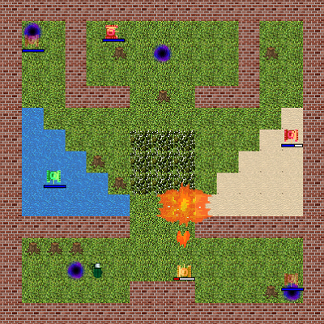
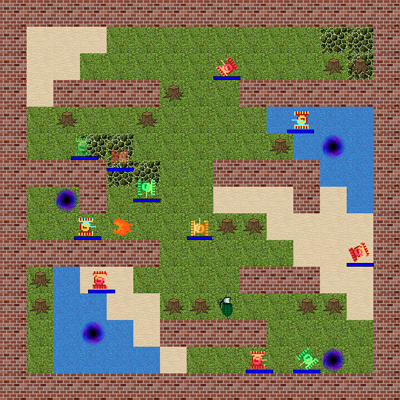

## Tanks

Tanks - 2D-игра, написанная на C++ с использованием 
[Qt framework (5.15.0+)](https://www.qt.io). Игра предназначена для ПК, но может
работать и на Android-смартфонах.

Суть игры: на ограниченной карте со стенами, различными типами покрытия,
препятствиями, бонусами и телепортами уничтожить всех ботов. Доступны четыре
карты, три вида ботов (от почти бездействующих до ботов, осуществляющих поиск
игрока), три танка игрока с разными характеристиками, а также различные виды
снарядов. Более подробная информация об объектах игры расположена в секции
"Информация" внутри программы.

Игра является учебным проектом студентов 4 группы 1 курса факультета
прикладной математики и информатики БГУ (2 семестр 2018-2019): 
* Гармаза Александра ([@sashhrmz](https://github.com/sashhrmz))
* Неверо Андрей ([@anevero](https://github.com/anevero))
* Тарайкович Алеся ([@Lessyless](https://github.com/Lessyless))

В программе используется музыка 
[David Fesliyan](https://www.fesliyanstudios.com/) и
[spinningmerkaba](http://dig.ccmixter.org/people/jlbrock44).

## Статус разработки

Основная стадия разработки завершена в мае 2019 года. После мая 2019 года 
несколько раз выпускались небольшие обновления, включающие в себя рефакторинг
кода и обеспечение совместимости проекта с актуальными версиями Qt.

Последняя версия программы - [0.8.4](https://github.com/anevero/tanks/tree/0.8.4).

В секции [releases](https://github.com/anevero/tanks/releases/tag/0.8.4) 
можно найти установщики игры для 32- и 64-разрядной Windows, 64-разрядной
Ubuntu, а также apk-файл для установки игры на Android-смартфон. 

Установщики для Windows и Linux были созданы с использованием утилиты 
[CQtDeployer](https://github.com/QuasarApp/CQtDeployer). Для удаления программы
после ее установки на этих операционных системах достаточно запустить файл
*TanksTool* из папки, куда была установлена игра.

Если вы хотите запустить игру на другой ОС, склонируйте репозиторий и 
скомпилируйте проект самостоятельно (инструкции можно найти ниже).

Учтите, что приложение тестировалось только на Windows 10 1803, Ubuntu 18.04 и
нескольких Android-устройствах с разными версиями Android и разными оболочками.
Корректная работа приложения на других ОС (включая *любые версии* Android) не
гарантируется.

## Статус ветви master

После каждого нового коммита запускается автоматическая сборка и статический 
анализ кода проекта. Обычно это занимает до пяти минут. Если виджет загорается
зелёным, всё в порядке. В противном случае (красный или серый цвет) на
каком-то этапе возникли ошибки. Чтобы увидеть их описания, кликните по виджету.
Чтобы просмотреть результаты сборки и проверки кода в другой ветви разработки,
пройдите по [данной ссылке](https://travis-ci.com/anevero/tanks/branches) и
выберите нужный коммит.

Узнать, на каком этапе произошла ошибка, можно с помощью логов Travis. 
Проблемная команда подсвечивается красным. Возможны следующие варианты:
* `make`: отвечает за сборку проекта.
* `cppcheck`: отвечает за статический анализ кода.
* `cpplint`: отвечает за статический анализ кода.

Замечания `cppcheck` не влияют на статус сборки (из-за большого количества
ложноположительных срабатываний), но рекомендуется все же обращать на них
внимание. Предупреждения `cpplint` влияют на статус сборки, и игнорировать их
нельзя.

## Сборка проекта с помощью QMake

Для того, чтобы собрать проект с помощью QMake в составе Qt Creator, 
достаточно склонировать репозиторий и запустить файл *tanks.pro*. 

Сборку проекта под Linux рекомендуется осуществлять с помощью **GCC64**, под
Windows - с помощью **MinGW64**.

Сборка проекта под Android - несколько более сложная процедура. Немного
подробнее об этом можно почитать в
[документации](https://doc.qt.io/qt-5/android-getting-started.html).
Обратите внимание на то, что в проекте используются не совсем стандартные
манифест и скрипты Gradle. В последних можно найти информацию о том, какие
версии некоторых компонентов необходимы для сборки проекта.

Для редактирования переводов приложения следует использовать входящие в состав
Qt утилиты [lupdate](https://doc.qt.io/qt-5/linguist-manager.html#using-lupdate)
и [lrelease](https://doc.qt.io/qt-5/linguist-manager.html#using-lrelease), а
также [Qt Linguist](https://doc.qt.io/qt-5/qtlinguist-index.html).

## Сборка проекта с помощью CMake

В некоторых случаях с проектом удобнее работать, например, в среде разработки
CLion, которая не поддерживает QMake. В этом случае проект нужно собирать с
помощью CMake. Это сложнее, чем в случае с QMake, но вполне реально.

Сначала необходимо склонировать репозиторий. Как можно видеть, в него включен
пример скрипта *CMakeLists.txt*, который можно использовать в качестве основы.
В нем достаточно поменять лишь одну строчку: указать путь к входящим в состав
Qt конфигурационным файлам CMake. Пример (строка из скрипта в репозитории):

`set(CMAKE_PREFIX_PATH "~/Qt/5.15.0/gcc_64/lib/cmake")`

После этого на Linux проект можно импортировать в CLion для дальнейшей работы.
Под Windows необходимы дополнительные действия. Нужно указать в *Path*
путь к компилятору в составе Qt, а также путь к библиотекам Qt. Например:

`C:\Qt\Tools\mingw810_64\bin`

`C:\Qt\5.15.0\mingw81_64\bin`

Настоятельно рекомендуется переместить эти строки в *Path* как можно 
выше. Дело в том, что Qt относительно часто используется в стороннем
ПО, ссылки на которое могут присутствовать в *Path*. При компиляции выбираются
первые найденные по адресам в *Path* библиотеки. В случае, если выбраны
принадлежащие сторонним программам библиотеки, корректно собрать и запустить
проект может и не получиться из-за различий в их версиях.

После внесения изменений в *Path* необходимо перезагрузить Windows. Далее
рекомендуется выбрать в CLion компилятор, входящий в состав Qt (указать путь к 
нему в **Settings - Toolchains**). После этого можно работать с проектом.

### Ограничения CLion

Учитывайте, что при использовании CLion вам придется смириться со следующими
ограничениями:
* По умолчанию с классами Qt не будет работать дебаггер. Вероятно, это можно
исправить.
* По умолчанию приложение нельзя будет скомпилировать, подписать и запустить
под Android. Возможно, существуют решения этой проблемы.
* Для редактирования и генерации файлов перевода все равно нужны утилиты
Qt.

## Известные проблемы при сборке проекта

При сборке проекта под Windows рекомендуется использовать актуальную
версию Qt (как минимум 5.13.2). Если собирать его с помощью более старой
версии Qt (в частности, 5.12.4 - 5.13.1), игра может работать некорректно.
Это связано с багом в библиотеке Qt Multimedia, который был исправлен
в Qt 5.13.2.

При сборке проекта под Android необходимо использовать самую актуальную
версию Qt (как минимум 5.15.0). Если собирать его с помощью более старой
версии Qt, проект может не скомпилироваться. Это связано с изменением структуры
манифеста в Qt 5.14-5.15.

## Известные проблемы в работе игры

В связи с тем, что в последних версиях Qt использование QToolTip под Android
влечет за собой мгновенный segmentation fault и падение приложения
([баг-репорт](https://bugreports.qt.io/browse/QTBUG-83916)), соответствующая
функциональность (отображение здоровья по нажатию на танк) была отключена при
компиляции под Android и пока недоступна в игре.
