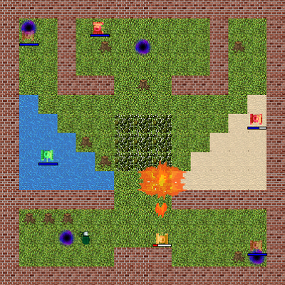
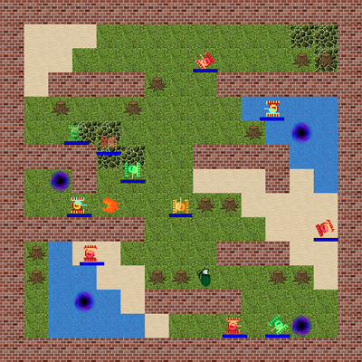

## Tanks

Tanks - 2D-игра, написанная на C++ с использованием Qt framework (5.9+). Игра предназначена для ПК, но может работать и на Android-смартфонах.

Суть игры: на ограниченной карте со стенами, различными типами покрытия, препятствиями, бонусами и телепортами уничтожить всех ботов. Доступны четыре карты, три вида ботов (от почти бездействующих до ботов, осуществляющих поиск игрока), три танка игрока с разными характеристиками, а также различные виды снарядов.
Более подробная информация об объектах игры расположена в секции "Информация" внутри программы.

Игра является учебным проектом студентов 4 группы 1 курса факультета прикладной математики и информатики БГУ (2 семестр 2018-2019): 
* Гармаза Александра ([@sashhrmz](https://github.com/sashhrmz))
* Неверо Андрей ([@anevero](https://github.com/anevero))
* Тарайкович Алеся ([@Lessyless](https://github.com/Lessyless))

## Статус разработки

Разработка завершена в мае 2019 года. Последняя версия программы - [0.7](https://github.com/anevero/tanks/tree/0.7). 

В секции [releases](https://github.com/anevero/tanks/releases/tag/0.7) можно найти архив с файлами программы, с помощью которого игру можно запустить под 64-разрядной Windows, а также APK-файл для установки игры на Android-смартфон. Если вы хотите запустить игру на другой ОС, склонируйте репозиторий и скомпилируйте проект самостоятельно. 

Учтите, что приложение тестировалось только на Windows 10 1803, Ubuntu 18.04 и Android 7.0 с оболочкой MIUI 10. Корректная работа приложения на других ОС (включая *любые версии* Android) не гарантируется.

## Статус ветви master

После каждого нового коммита запускается автоматическая сборка и статический анализ кода проекта. Обычно это занимает до пяти минут. Если виджет загорается зелёным, всё в порядке. В противном случае (красный или серый цвет) на каком-то этапе возникли ошибки. Чтобы увидеть их описания, кликните по виджету. Чтобы просмотреть результаты сборки и проверки кода в другой ветви разработки, пройдите по [данной ссылке](https://travis-ci.com/anevero/tanks/branches) и выберите нужный коммит.

Узнать, на каком этапе произошла ошибка, можно с помощью логов Travis. Проблемная команда подсвечивается красным. Возможны следующие варианты:
* `make`: отвечает за сборку проекта.
* `cppcheck`: отвечает за статический анализ кода.

Сообщения, связанные со сборкой проекта, выводятся перед вердиктом выполнения команды `make`. Сообщения, связанные со стилем кода, выводятся в самом конце лога командами `cat`. Замечания о том, что какие-то функции не используются, можно игнорировать (эти предупреждения не влияют на статус сборки), но все, что находится после них, игнорировать не стоит.

Используемый для проверки стиля кода статический анализатор, возможно, не самый продвинутый, поэтому настоятельно рекомендуется обращать внимание на предупреждения *clang-tidy* в IDE, а также использовать встроенный в Qt Creator плагин *clang-format* (инструкция по его активации находится ниже).

## Активация clang-format в Qt Creator

Установите утилиту **clang-format**. В Linux используйте менеджер пакетов вашего дистрибутива, в частности, в Ubuntu:

`sudo apt-get install clang-format`

В Windows установка **Clang** и необходимых компонентов осуществляется с помощью установочного файла, который можно загрузить с [сайта LLVM](http://releases.llvm.org/download.html) (раздел *Pre-built Binaries*, выберите ссылку, соответствующую разрядности вашей системы). 

В Qt Creator пройдите в меню **Help - About Plugins**, где поставьте галочку напротив пункта **Beautifier (experimental)**. 
Перезагрузите IDE. После этого пройдите в меню **Tools - Options - Beautifier**. Во вкладке **General** поставьте галочку **Enable auto format on file save** и выберите в графе **Tool** пункт **ClangFormat**. Затем во вкладке **Clang Format** в выпадающем списке **Use predefined style** выберите **Google**. Если вы используете Windows, в этой же вкладке дополнительно требуется указать путь к утилите **clang-format**. Если вы не изменяли стандартный путь установки, вам нужно выбрать файл **C:\Program Files\LLVM\bin\clang-format.exe**. После всех этих операций нажмите **Apply** и **OK**. 
